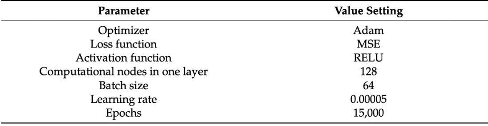
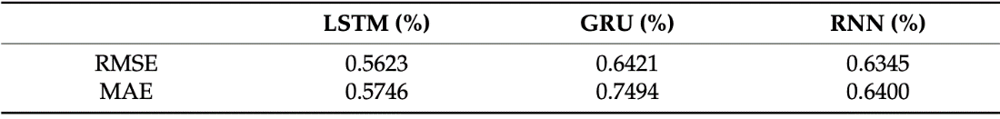

# RUL-estimation-of-lithium-batteries
<h1>Table of Contents</h1>

<ol>
  <li><a href="#introduction">Introduction</a></li>
  <li><a href="#preliminary-analysis">Preliminary Analysis</a></li>
  <li><a href="#calce-dataset">CALCE Dataset</a></li>
  <li><a href="#state-of-the-art">State of the Art</a></li>
  <li><a href="#tools">Tools</a></li>
  <li><a href="#methods-and-techniques">Methods and Techniques</a></li>
  <li><a href="#lstm-model-efficiency">Efficiency of Long Short-Term Memory Model</a></li>
  <li><a href="#usage">Usage</a></li>
  <li><a href="#our-proposal">Our Proposal</a></li>
  <li><a href="#esn-echo-state-network">ESN (Echo State Network)</a></li>
</ol>

<h1 id="introduction">Introduction</h1>

The central goal of this project is to develop a predictive model based on data to estimate the Remaining Useful Life (RUL) of lithium-ion batteries. The estimation will be performed using only current and voltage data as inputs, which are often the only available data under normal operating conditions.

To better understand the context, RUL in batteries is commonly expressed in terms of remaining discharge cycles before the actual capacity reaches 80% of the nominal capacity. This parameter is crucial for monitoring battery health and planning proactive maintenance or replacement, thereby reducing the risk of malfunctions or failures.

In this report, we will estimate RUL using the CALCE dataset. This dataset has undergone an Extraction, Transformation, and Loading (ETL) phase to prepare the necessary information for our analysis. As a starting point for our methodology, we will rely on the paper titled "Online State of Health Estimation of Lithium-Ion Batteries Based on Charging Process and Long Short-Term Memory Recurrent Neural Network." This document will provide us with initial guidance, but we aim to extend and adapt the methodology based on the specific needs of our study.

Through an experimental approach, we intend to explore and evaluate different facets of the problem, seeking to improve and customize the model to achieve more accurate and robust estimates of the RUL of lithium-ion batteries. In this report, we will delve into the analysis and experimentation process, outlining methodological choices, encountered challenges, and obtained results. The ultimate goal is to contribute to lithium-ion battery research and provide a reliable predictive model for estimating Remaining Useful Life under normal operational conditions.

<h1 id="preliminary-analysis">Preliminary Analysis</h1>

<h2 id="calce-dataset">Dataset CALCE</h2>

The examined dataset is CALCE, focusing primarily on the CS2 Battery section, providing crucial details about lithium-ion batteries. To offer a more detailed context, CS2 cells underwent a standard charging protocol known as constant current/constant voltage. This protocol involved a constant current rate of 0.5 C until the voltage reached 4.2 V. Subsequently, the voltage was maintained at 4.2 V until the charging current dropped below 0.05 A. Unless specified otherwise, the discharge cutoff voltage for these batteries was fixed at 2.7 V.

CS2 cells were uniquely named through random numbering, like 'CS2_n,' with 'n' representing the assigned number for each cell. Each CS2 cell underwent repeated cycles according to the specifications listed next to its name in the reference table. Each cell generated data files in Excel format, identified by test dates.

The datasets we refer to range from CS2-33 to CS2-38 and contain detailed information about charge and discharge cycles performed on each cell. These data are valuable for our analysis of the Remaining Useful Life (RUL) of lithium-ion batteries, allowing us to develop a predictive model based on real experiences and specific charge/discharge process data.

<h3>Data Structure:</h3>
<table>
  <thead>
    <tr>
      <th>Data</th>
      <th>Description</th>
    </tr>
  </thead>
  <tbody>
    <tr>
      <td>Data_Point</td>
      <td>Number of the data point.</td>
    </tr>
    <tr>
      <td>Test_Time(s)</td>
      <td>Total time elapsed from the start of the test, measured in seconds. Represents the overall duration of the entire conducted test.</td>
    </tr>
    <tr>
      <td>Date_Time</td>
      <td>Date and time of the observation.</td>
    </tr>
    <tr>
      <td>Step_Time(s)</td>
      <td>Time elapsed during the specific phase of the test in seconds.</td>
    </tr>
    <tr>
      <td>Step_Index</td>
      <td>Index identifying the specific phase of the test.</td>
    </tr>
    <tr>
      <td>Cycle_Index</td>
      <td>Index identifying the charge/discharge cycle.</td>
    </tr>
    <tr>
      <td>Current(A)</td>
      <td>Electric current in amperes during the observation.</td>
    </tr>
    <tr>
      <td>Voltage(V)</td>
      <td>Electric voltage in volts during the observation.</td>
    </tr>
    <tr>
      <td>Charge_Capacity(Ah)</td>
      <td>Charge capacity in ampere-hours.</td>
    </tr>
    <tr>
      <td>Discharge_Capacity(Ah)</td>
      <td>Discharge capacity in ampere-hours.</td>
    </tr>
    <tr>
      <td>Charge_Energy(Wh)</td>
      <td>Charge energy in watt-hours.</td>
    </tr>
    <tr>
      <td>Discharge_Energy(Wh)</td>
      <td>Discharge energy in watt-hours.</td>
    </tr>
    <tr>
      <td>dV/dt(V/s)</td>
      <td>Rate of change of voltage over time.</td>
    </tr>
    <tr>
      <td>Internal_Resistance(Ohm)</td>
      <td>Internal resistance of the system in ohms.</td>
    </tr>
    <tr>
      <td>Is_FC_Data</td>
      <td>Indicates if the data refers to a cell formation test.</td>
    </tr>
    <tr>
      <td>AC_Impedance(Ohm)</td>
      <td>AC impedance in ohms.</td>
    </tr>
    <tr>
      <td>ACI_Phase_Angle(Deg)</td>
      <td>Phase angle in alternating current.</td>
    </tr>
  </tbody>
</table>

<h1 id="state-of-the-art">State of the Art</h1>

Referring to the paper titled "Online State of Health Estimation of Lithium-Ion Batteries Based on Charging Process and Long Short-Term Memory Recurrent Neural Network," it serves as a starting point for the current study. The paper analyzes two crucial datasets: CALCE and NASA, both containing fundamental information about lithium-ion batteries.

Initially, the concept of State of Health (SOH) is defined as the ratio of the battery's current capacity to its nominal capacity, expressed as a percentage using the formula:

<math xmlns="http://www.w3.org/1998/Math/MathML">
  <mtext>SOH</mtext> 
  <mo>=</mo>
  <mfrac>
    <mi>CP</mi>
    <mi>CN</mi>
  </mfrac>
  <mo>&#x00D7;</mo>
  <mn>100</mn>
</math>

Where (C_N) represents the nominal capacity, and (C_P) is the current capacity of the battery.

To estimate the Remaining Useful Life (RUL), health indicators related to voltage and current are calculated:

<math xmlns="http://www.w3.org/1998/Math/MathML">
  <mtext>HI</mtext><msub><mi>v</mi><mi>i</mi></msub>
  <mo>=</mo>
  <mo>&#x222B;</mo>
  <msubsup>
    <mi>v</mi>
    <mrow>
      <mi>t0</mi>
    </mrow>
    <mrow>
      <mi>t1</mi>
    </mrow>
  </msubsup>
  <mi>dt</mi>
</math>

Calculated as the integral between (t_0) and (t_1) of the voltage, where (t_0) is when the voltage is 3.8 V, and (t_1) is when it's 4.2 V. Meanwhile:

<math xmlns="http://www.w3.org/1998/Math/MathML">
  <mtext>HI</mtext><msub><mi>i</mi><mi>i</mi></msub>
  <mo>=</mo>
  <mo>&#x222B;</mo>
  <msubsup>
    <mi>i</mi>
    <mrow>
      <mi>t0</mi>
    </mrow>
    <mrow>
      <mi>t1</mi>
    </mrow>
  </msubsup>
  <mi>dt</mi>
</math>

Calculated as the integral between (t_0) and (t_1) of the current, where (t_0) marks the beginning of the charging period, and (t_1) marks its conclusion.

Three different model architectures were explored: Sim-RNN, LSTM, and GRU. These models were trained on datasets CS2-36 and CS2-38 and later tested on CS2-33, CS2-35, and CS2-37.

Performance analysis involved using the metrics MAE and RMSE, defined respectively as:

<math xmlns="http://www.w3.org/1998/Math/MathML">
  <mtext>RMSE</mtext>
  <mo>=</mo>
  <msqrt>
    <mfrac>
      <mn>1</mn>
      <mi>m</mi>
    </mfrac>
    <munderover>
      <mo>&#x2211;</mo>
      <mrow>
        <mi>i</mi>
        <mo>=</mo>
        <mn>1</mn>
      </mrow>
      <mi>m</mi>
    </munderover>
    <mo>&#x221A;</mo>
    <mo stretchy="false">(</mo>
    <mrow>
      <msup>
        <mrow>
          <mtext>SOH</mtext><mi>i</mi>
        </mrow>
        <mo>2</mo>
      </msup>
      <mo>-</mo>
      <mo>&#x00AF;</mo>
      <mo stretchy="false">(</mo>
      <mrow>
        <mtext>SOH</mtext><mi>i</mi><mo>*</mo>
      </mrow>
      <mo>)</mo>
      <mo>2</mo>
    </mrow>
    <mo stretchy="false">)</mo>
  </msqrt>
</math>

<math xmlns="http://www.w3.org/1998/Math/MathML">
  <mtext>MAE</mtext>
  <mo>=</mo>
  <mfrac>
    <mn>1</mn>
    <mi>m</mi>
  </mfrac>
  <munderover>
    <mo>&#x2211;</mo>
    <mrow>
      <mi>i</mi>
      <mo>=</mo>
      <mn>1</mn>
    </mrow>
    <mi>m</mi>
  </munderover>
  <mo>|</mo>
  <mrow>
    <mtext>SOH</mtext><mi>i</mi>
    <mo>-</mo>
    <mo>&#x00AF;</mo>
    <mo stretchy="false">(</mo>
    <mrow>
      <mtext>SOH</mtext><mi>i</mi><mo>*</mo>
    </mrow>
    <mo>)</mo>
  </mrow>
  <mo>|</mo>
</math>

Where (SOH_i^*) represents the prediction of SOH for the \(i\)-th example, and \(\text{SOH}_i\) is the \(i\)-th actual value.

In the context of online estimation of State of Health (SOH), the Long Short-Term Memory Recurrent Neural Network (LSTM-RNN), Recurrent Neural Network with Gated Recurrent Unit (GRU-RNN), and Simple Recurrent Neural Network (Sim-RNN) were compared for effectiveness and performance. All algorithms were configured with the same structure and parameters, except for the main working layers of RNN and GRU.

Despite GRU-RNN requiring more training epochs, LSTM-RNN showed slightly better performance. SOH estimations closely followed the actual values, with estimation errors within 2% for all three networks. The proposed model demonstrated accurate online health estimation based on data extracted from the charging process.

The results of the state of the art are as follows:

