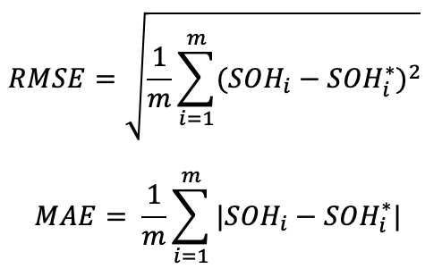
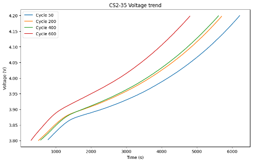
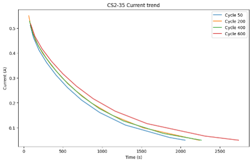
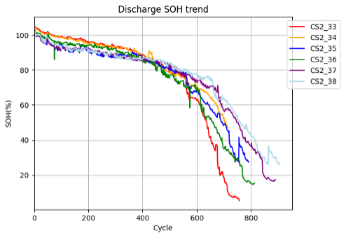

# RUL-estimation-of-lithium-batteries
<h1>Table of Contents</h1>

<ol>
  <li><a href="#introduction">Introduction</a></li>
  <li><a href="#preliminary-analysis">Preliminary Analysis</a></li>
  <li><a href="#calce-dataset">CALCE Dataset</a></li>
  <li><a href="#state-of-the-art">State of the Art</a></li>
  <li><a href="#tools">Tools</a></li>
  <li><a href="#methods-and-techniques">Methods and Techniques</a></li>
  <li><a href="#lstm">LSTM</a></li>
  <li><a href="#usage">Usage</a></li>
  <li><a href="#our-proposal">Our Proposal</a></li>
  <li><a href="#esn-echo-state-network">ESN (Echo State Network)</a></li>
</ol>

<h1 id="introduction">Introduction</h1>

The central goal of this project is to develop a predictive model based on data to estimate the Remaining Useful Life (RUL) of lithium-ion batteries. The estimation will be performed using only current and voltage data as inputs, which are often the only available data under normal operating conditions.

To better understand the context, RUL in batteries is commonly expressed in terms of remaining discharge cycles before the actual capacity reaches 80% of the nominal capacity. This parameter is crucial for monitoring battery health and planning proactive maintenance or replacement, thereby reducing the risk of malfunctions or failures.

In this report, we will estimate RUL using the CALCE dataset. This dataset has undergone an Extraction, Transformation, and Loading (ETL) phase to prepare the necessary information for our analysis. As a starting point for our methodology, we will rely on the paper titled "Online State of Health Estimation of Lithium-Ion Batteries Based on Charging Process and Long Short-Term Memory Recurrent Neural Network." This document will provide us with initial guidance, but we aim to extend and adapt the methodology based on the specific needs of our study.

Through an experimental approach, we intend to explore and evaluate different facets of the problem, seeking to improve and customize the model to achieve more accurate and robust estimates of the RUL of lithium-ion batteries. In this report, we will delve into the analysis and experimentation process, outlining methodological choices, encountered challenges, and obtained results. The ultimate goal is to contribute to lithium-ion battery research and provide a reliable predictive model for estimating Remaining Useful Life under normal operational conditions.

<h1 id="preliminary-analysis">Preliminary Analysis</h1>

<h2 id="calce-dataset">Dataset CALCE</h2>

The examined dataset is CALCE, focusing primarily on the CS2 Battery section, providing crucial details about lithium-ion batteries. To offer a more detailed context, CS2 cells underwent a standard charging protocol known as constant current/constant voltage. This protocol involved a constant current rate of 0.5 C until the voltage reached 4.2 V. Subsequently, the voltage was maintained at 4.2 V until the charging current dropped below 0.05 A. Unless specified otherwise, the discharge cutoff voltage for these batteries was fixed at 2.7 V.

CS2 cells were uniquely named through random numbering, like 'CS2_n,' with 'n' representing the assigned number for each cell. Each CS2 cell underwent repeated cycles according to the specifications listed next to its name in the reference table. Each cell generated data files in Excel format, identified by test dates.

The datasets we refer to range from CS2-33 to CS2-38 and contain detailed information about charge and discharge cycles performed on each cell. These data are valuable for our analysis of the Remaining Useful Life (RUL) of lithium-ion batteries, allowing us to develop a predictive model based on real experiences and specific charge/discharge process data.

<h3>Data Structure:</h3>
<table align="center">
  <thead>
    <tr>
      <th>Data</th>
      <th>Description</th>
    </tr>
  </thead>
  <tbody>
    <tr>
      <td>Data_Point</td>
      <td>Number of the data point.</td>
    </tr>
    <tr>
      <td>Test_Time(s)</td>
      <td>Total time elapsed from the start of the test, measured in seconds. Represents the overall duration of the entire conducted test.</td>
    </tr>
    <tr>
      <td>Date_Time</td>
      <td>Date and time of the observation.</td>
    </tr>
    <tr>
      <td>Step_Time(s)</td>
      <td>Time elapsed during the specific phase of the test in seconds.</td>
    </tr>
    <tr>
      <td>Step_Index</td>
      <td>Index identifying the specific phase of the test.</td>
    </tr>
    <tr>
      <td>Cycle_Index</td>
      <td>Index identifying the charge/discharge cycle.</td>
    </tr>
    <tr>
      <td>Current(A)</td>
      <td>Electric current in amperes during the observation.</td>
    </tr>
    <tr>
      <td>Voltage(V)</td>
      <td>Electric voltage in volts during the observation.</td>
    </tr>
    <tr>
      <td>Charge_Capacity(Ah)</td>
      <td>Charge capacity in ampere-hours.</td>
    </tr>
    <tr>
      <td>Discharge_Capacity(Ah)</td>
      <td>Discharge capacity in ampere-hours.</td>
    </tr>
    <tr>
      <td>Charge_Energy(Wh)</td>
      <td>Charge energy in watt-hours.</td>
    </tr>
    <tr>
      <td>Discharge_Energy(Wh)</td>
      <td>Discharge energy in watt-hours.</td>
    </tr>
    <tr>
      <td>dV/dt(V/s)</td>
      <td>Rate of change of voltage over time.</td>
    </tr>
    <tr>
      <td>Internal_Resistance(Ohm)</td>
      <td>Internal resistance of the system in ohms.</td>
    </tr>
    <tr>
      <td>Is_FC_Data</td>
      <td>Indicates if the data refers to a cell formation test.</td>
    </tr>
    <tr>
      <td>AC_Impedance(Ohm)</td>
      <td>AC impedance in ohms.</td>
    </tr>
    <tr>
      <td>ACI_Phase_Angle(Deg)</td>
      <td>Phase angle in alternating current.</td>
    </tr>
  </tbody>
</table>

<h1 id="state-of-the-art">State of the Art</h1>

Referring to the paper titled "Online State of Health Estimation of Lithium-Ion Batteries Based on Charging Process and Long Short-Term Memory Recurrent Neural Network," it serves as a starting point for the current study. The paper analyzes two crucial datasets: CALCE and NASA, both containing fundamental information about lithium-ion batteries.

Initially, the concept of State of Health (SOH) is defined as the ratio of the battery's current capacity to its nominal capacity, expressed as a percentage using the formula:

SOH = CP/CN × 100

Where CN represents the nominal capacity, and CP is the current capacity of the battery.

To estimate the Remaining Useful Life (RUL), health indicators related to voltage and current are calculated:

<math xmlns="http://www.w3.org/1998/Math/MathML">
  <msub><mi>HI</mi><mi>v</mi></msub>
  <mo>=</mo>
  <mo>&#x222B;</mo>
  <msubsup>
    <mi>v</mi>
    <mrow>
      <mi>t0</mi>
    </mrow>
    <mrow>
      <mi>t1</mi>
    </mrow>
  </msubsup>
  <mi>dt</mi>
</math>

Calculated as the integral between t0 and t1 of the voltage, where t0 is when the voltage is 3.8 V, and t1 is when it's 4.2 V. Meanwhile:

<math xmlns="http://www.w3.org/1998/Math/MathML">
  <msub><mi>HI</mi><mi>i</mi></msub>
  <mo>=</mo>
  <mo>&#x222B;</mo>
  <msubsup>
    <mi>i</mi>
    <mrow>
      <mi>t0</mi>
    </mrow>
    <mrow>
      <mi>t1</mi>
    </mrow>
  </msubsup>
  <mi>dt</mi>
</math>

Calculated as the integral between t0 and t1 of the current, where t0 marks the beginning of the charging period, and t1 marks its conclusion.

Three different model architectures were explored: Sim-RNN, LSTM, and GRU. These models were trained on datasets CS2-36 and CS2-38 and later tested on CS2-33, CS2-35, and CS2-37.

Performance analysis involved using the metrics MAE and RMSE, defined respectively as:

    

Where SOHi* represents the prediction of SOH for the i-th example, and SOHi is the i-th actual value.

In the context of online estimation of State of Health (SOH), the Long Short-Term Memory Recurrent Neural Network (LSTM-RNN), Recurrent Neural Network with Gated Recurrent Unit (GRU-RNN), and Simple Recurrent Neural Network (Sim-RNN) were compared for effectiveness and performance. All algorithms were configured with the same structure and parameters, except for the main working layers of RNN and GRU.

<table align="center">
    <thead>
      <tr>
        <th>Parameter</th>
        <th>Value</th>
      </tr>
    </thead>
    <tbody>
      <tr>
        <td>Optimizer</td>
        <td>Adam</td>
      </tr>
      <tr>
        <td>Loss function</td>
        <td>MSE</td>
      </tr>
      <tr>
        <td>Activation funcion</td>
        <td>RELU</td>
      </tr>
      <tr>
        <td>Computational nodes in a row</td>
        <td>128</td>
      </tr>
      <tr>
        <td>Batch size</td>
        <td>64</td>
      </tr>
      <tr>
        <td>Learning rate</td>
        <td>0.00005</td>
      </tr>
      <tr>
        <td>Epochs</td>
        <td>15,000</td>
      </tr>
    </tbody>
  </table>

Despite GRU-RNN requiring more training epochs, LSTM-RNN showed slightly better performance. SOH estimations closely followed the actual values, with estimation errors within 2% for all three networks. The proposed model demonstrated accurate online health estimation based on data extracted from the charging process.

The results of the state of the art are as follows:

<table align="center">
    <caption>RMSE and MAE for different models</caption>
    <thead>
      <tr>
        <th>Model</th>
        <th>RMSE (%)</th>
        <th>MAE (%)</th>
      </tr>
    </thead>
    <tbody>
      <tr>
        <td>LSTM</td>
        <td>0.5623</td>
        <td>0.5746</td>
      </tr>
      <tr>
        <td>GRU</td>
        <td>0.6421</td>
        <td>0.7494</td>
      </tr>
      <tr>
        <td>RNN</td>
        <td>0.6345</td>
        <td>0.6400</td>
      </tr>
    </tbody>
  </table>

<h1 id="tools">Tools</h1>

The project was developed using Visual Studio Code (VSCode) in a Python environment, leveraging various key libraries to ensure effective implementation and data analysis. Below are the main libraries used and their role in the project context:

<h2>Pandas: Data Manipulation</h2>

Pandas is a data analysis library that provides flexible and high-performance data structures, particularly DataFrames. In our project, Pandas was crucial for dataset cleaning. Through its ability to handle heterogeneous data, Pandas allowed us to perform filtering operations, eliminate missing data, and create health indicators necessary for model training.

<h2>Tensorflow: Model Creation</h2>

Tensorflow is an open-source framework for machine learning and AI. Its versatility and power made it the ideal choice for creating the prediction model. Through Tensorflow, we defined the architecture of our neural network and managed the entire training process. Its flexibility allowed us to adapt the model to the specific needs of our project.

<h2>NumPy: Efficient Data Handling</h2>

NumPy is a fundamental library for handling multidimensional arrays. In our context, Numpy was used to efficiently handle the model's input data. Its functionalities allowed us to perform complex mathematical operations and organize data into optimized structures, contributing to the proper feeding of the model during training and evaluation phases.

<h2>Matplotlib: Visualizations and Graphs</h2>

Matplotlib is a data visualization library that offers a wide range of graphical options. We used Matplotlib to create meaningful charts and visualizations. Through this library, we were able to analyze model results, plot curves, and visualize data patterns, enhancing our understanding of the predictive model's behavior.

<h1 id="methods-and-techniques">Methods and Techniques</h1>

<h2>ETL (Extract, Transform, Load)</h2>

ETL, an acronym for Extract, Transform, Load, is a fundamental process in data management. This methodology is used for the efficient movement of data from various sources to the destination system, making it accessible and usable for analysis. The process is divided into three key phases:

<ul>
  <li><strong>Extraction (Extract):</strong> Data is extracted from the original sources, which can include databases, files, or other data sources.</li>
  <li><strong>Transformation (Transform):</strong> Data undergoes a series of transformations, including filtering, cleaning, dimensionality reduction, or restructuring to conform to the destination system's needs.</li>
  <li><strong>Loading (Load):</strong> Transformed data is loaded into the destination system, making it easily accessible for analysis and further processing.</li>
</ul>

Prior to proceeding with data analysis and processing, an ETL operation was performed to simplify the structure of the original dataset. The initial data was organized in different Excel files, each corresponding to a specific date of charge and discharge cycles. Each Excel file contained three sheets:

<ul>
  <li>An "Info" sheet containing some general information.</li>
  <li>One or more "Channel" sheets with the actual information recorded in approximately 30-second steps.</li>
  <li>A "Statistics" sheet containing some information related to the statistics of the "Channel" sheets.</li>
</ul>

During the ETL process, the following steps were executed:

<ul>
  <li><strong>Elimination of unnecessary sheets:</strong> All sheets other than "Channel" were eliminated.</li>
  <li><strong>Data transformations:</strong> Various transformations were applied to eliminate outliers and misleading values from the dataset, including:</li>
    <ul>
      <li>Deletion of logs with negative time variables.</li>
      <li>Removal of the current spike during the constant current (CC) to constant voltage (CV) charging phase.</li>
      <li>Elimination of significant differences between consecutive current values.</li>
      <li>Removal of cycles with significantly different capacities compared to neighboring cycles.</li>
    </ul>
</ul>

This process prepared the dataset for subsequent analysis by removing irrelevant data and ensuring the coherence and reliability of the remaining data.

<h2>ETL and HI Processing Code</h2>

The code described in <code>preprocessing/etl</code> and <code>preprocessing/hi</code> will generate two pairs of files for each dataset:

<ul>
  <li>A first file related to charge data, containing values associated with step indices 2 and 4 for each cycle.</li>
  <li>A second file related to discharge data, containing values related to step index 7 for each cycle.</li>
</ul>

This subdivision was adopted to simplify subsequent processing phases, particularly for calculating health indicators and streamline State of Health (SOH) calculation.

The resulting files allowed us to create graphs to visualize the trends of voltage and current, focusing on the cycles of interest. The analysis of the obtained graphs enables observation of how these trends reflect the state of the art in the field, providing valuable insights into the behavior and performance of the examined system.

    

    

<h2 id="soh-estimation">State of Health (SOH) Estimation</h2>

In our analysis, we adopt the concept of State of Health (SOH) to assess the integrity of batteries. This crucial parameter is based on the ratio between the current capacity of the battery and its nominal capacity, expressed as a percentage.

Formally:

SOH = CP/CN × 100

Where CP represents the current capacity of the battery, and CN is the nominal capacity. In our context, the nominal capacity is set to 1100 mAh, as specified in the CALCE dataset documentation.

To evaluate SOH, we calculated the current capacity both during the charging and discharging phases. This allows us to compare the health status of the battery under these two conditions.

In the graph related to the charging phase, we represent SOH as the difference between the first and last values of the charging capacity for each cycle. This is calculated considering step indices 2 and 4.

    

Similarly, in the graph related to the discharge phase, we calculate SOH as the difference between the first and last values of the discharge capacity for each cycle. This calculation is performed considering step index 7.

    

This approach allows us to clearly visualize the trend of the battery's state of health throughout its operational life, both during charging and discharging.

<h1 id="lstm">LSTM</h1>

LSTM, which stands for Long Short-Term Memory, is considered a significant advancement compared to Recurrent Neural Networks (RNNs). While RNNs are limited to "short-term memory," allowing the use of previous information at a specific point in time, LSTM goes further by introducing "long-term memory." This provides more comprehensive access to the history of information, thereby enhancing the learning and decision-making capabilities of neural networks. It's important to note that LSTM shares some features with Gated Recurrent Units (GRUs); both utilize gating mechanisms to manage temporal information in the network.

<h2>Architecture of LSTM</h2>

A typical LSTM unit, illustrated in the figure, consists of a cell, an input gate, an output gate, and a forget gate. Each of these plays a crucial role in regulating the flow of information in the network.

<ul>
  <li><strong>Cell State:</strong> Represents long-term memory, maintaining a list of past information.</li>
  <li><strong>Previous Hidden State:</strong> Corresponds to the output from the previous time step, similar to short-term memory.</li>
  <li><strong>Input Data:</strong> Includes the input value at the current time step.</li>
</ul>

By integrating these elements, LSTM efficiently manages both short-term and long-term memory, enabling more advanced learning and decision processes in neural networks.

<h2 id="lstm-gates">LSTM Gates</h2>

<h3 id="forget-gate">Forget Gate</h3>

The forget gate plays a critical role in determining the relevance of data in the cell state. It evaluates both the previous hidden state and the new input data, generating a vector with elements in the range [0,1] through a sigmoid activation function (σ). Trained to produce values close to 0 for irrelevant data and close to 1 for relevant data, the forget gate's outputs are multiplied by the previous cell state.

<h3 id="input-gate">Input Gate</h3>

The input gate serves a dual function: it assesses whether new information should be retained in the cell state and decides which new information to add. This gate involves two processes. The first process generates a new memory update vector (c̃) by combining the previous hidden state and new input data with a hyperbolic tangent activation function (tanh). This vector determines how much to update each component of the cell state. The second process identifies which components of the new input are worth remembering, given the context of the previous hidden state.

<h3 id="output-gate">Output Gate</h3>

After updating the long-term memory, the output gate determines the new hidden state. It uses the freshly updated cell state, the previous hidden state, and the new input data. The output gate applies the previous hidden state and current input data through a sigmoid-activated network to obtain the filter vector (o(t)).

The new cell state (c(t)) becomes the previous cell state (c(t-1)) for the next LSTM unit, while the new hidden state (h(t)) becomes the previous hidden state (h(t-1)) for the next LSTM unit. This process repeats until all time sequences are processed by the LSTM cells.

